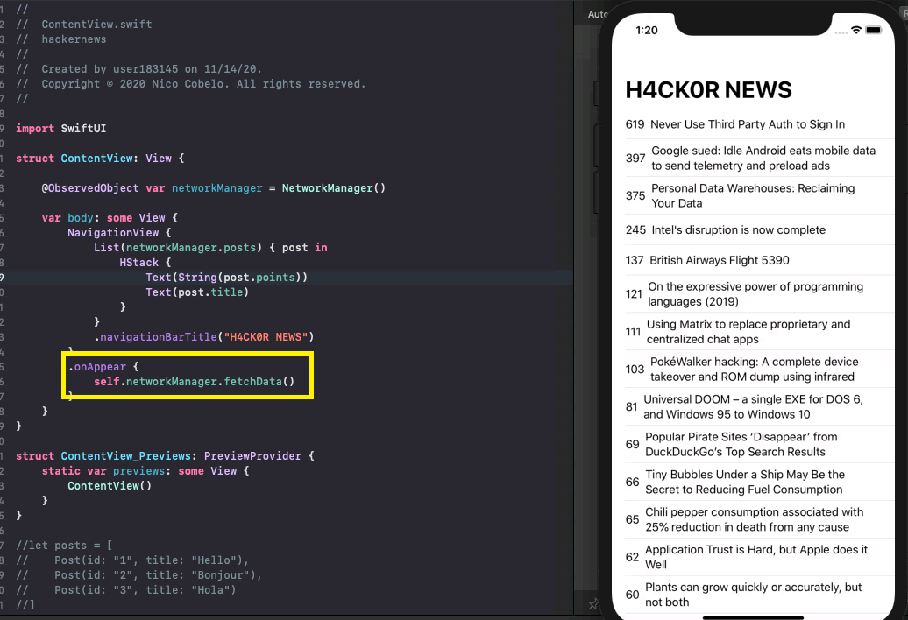

#  Hacker News

## Steps to create the app

* Created a List and added a Navigation Bar.

Found in Views/ContentView

* Used Networking to get Hacker News API's and apply it to the app.

Found in Models/NetworkManager

Found in Models/PostData

* Using the Post struct, I added the posts' titles and points to the List. 

Found in Views/ContentView

Found in Models/NetworkManager

* Created additional structs so when the user taps on the post, they get taken to the post's link.

Found in Views/DetailView

Found in Views/WebView

Found in Views/ContentView

